# 100daysofcode-python

## Day 01 - Band Name Generator ✅

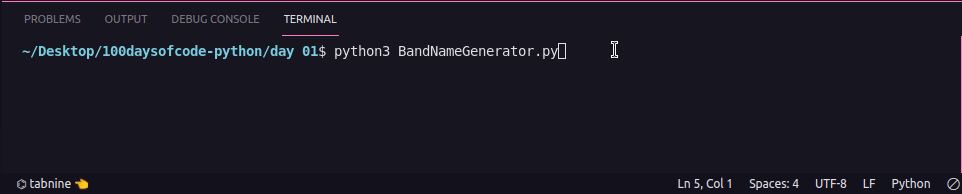

## Day 02 - Tip Calculator ✅

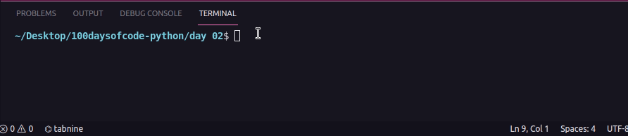

## Day 03 - Treasure Island ✅

### The Flow

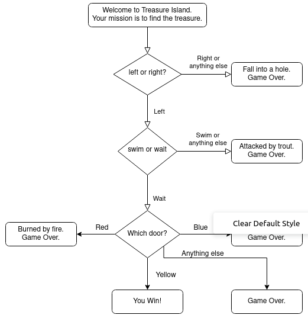

### The Solution

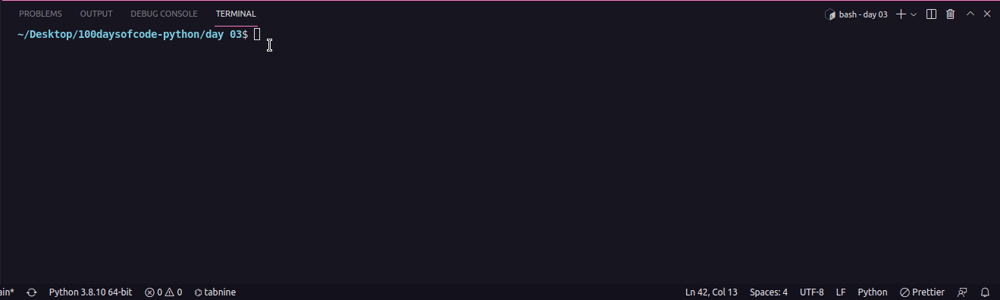

## Day 04 - Jokenpo ✅

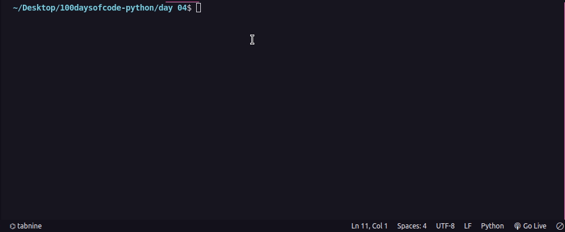

## Day 05 - Password Generator ✅

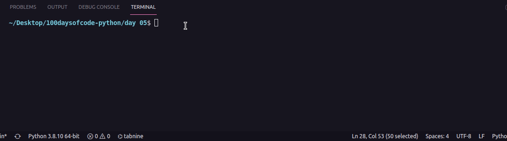

## Day 06 - Escaping the Maze ✅

## Day 07 - Hangman ✅

### The Flow

### The Game

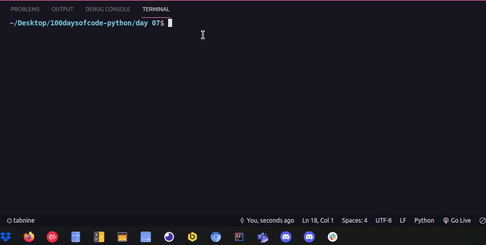

## Day 08 - Caesar Cipher ✅

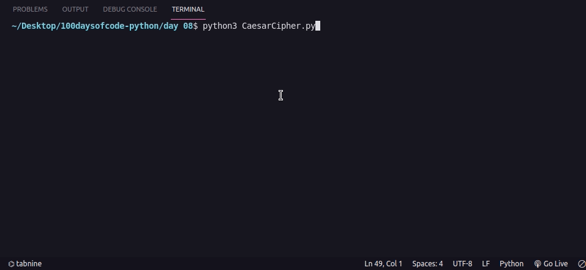

## Day 09 - Secret Auction ✅

### The Flow

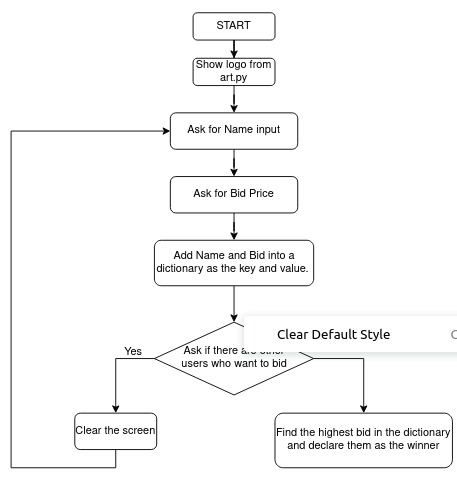

### The Solution

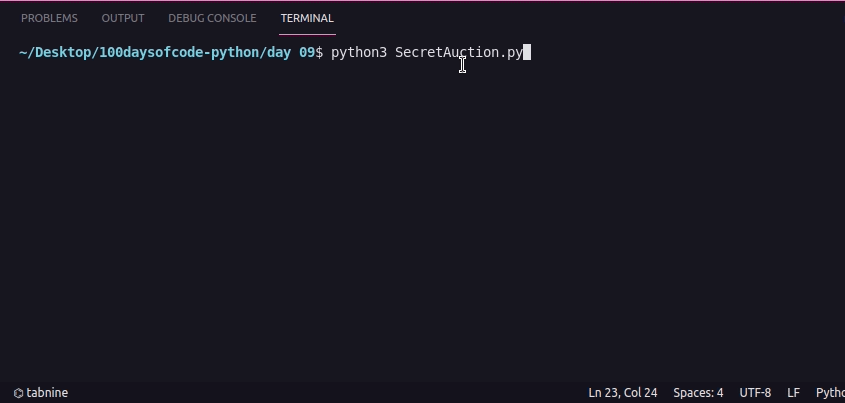

## Day 10 - Calculator ✅

## Day 11 - Black Jack ✅

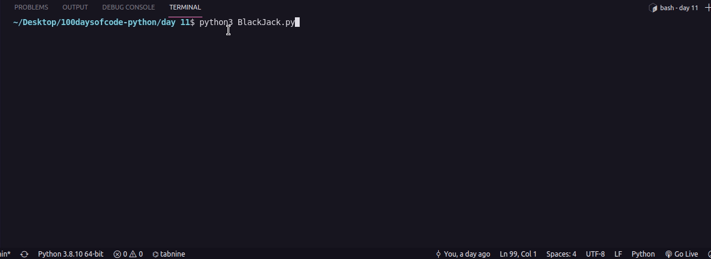

## Day 12 - Number Guess ✅

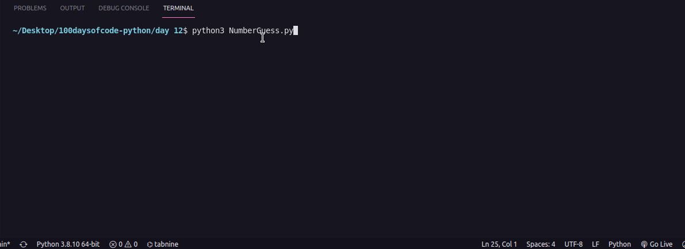

## Day 13 - Praticing Debbugging ✅

## Day 14 - Higher or Lower ✅

## Day 15 - Coffe Machine ✅

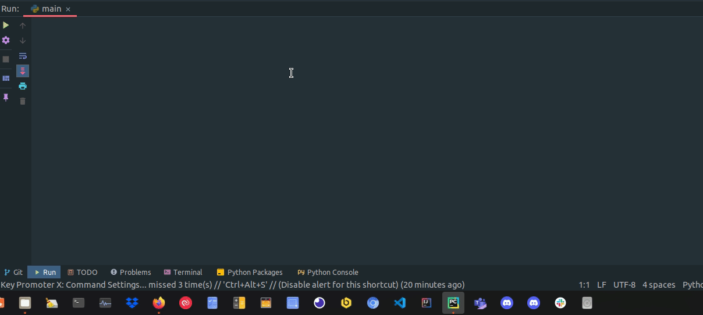

## Day 16 - Coffe Machine - in OOP ✅

## Day 17 - Trivia game ✅
