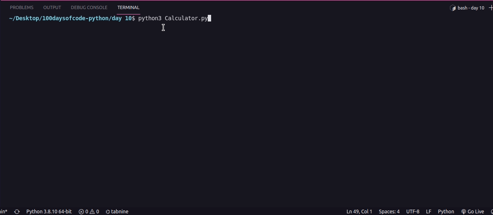

# 100daysofcode-python

## Challenge 01 - Band Name Generator ✅

## Challenge 02 - Tip Calculator ✅

## Challenge 03 - Treasure Island ✅

### The Flow

### The Solution

## Challenge 04 - Jokenpo ✅

## Challenge 05 - Password Generator ✅

## Challenge 06 - Escaping the Maze ✅

## Challenge 07 - Hangman ✅

### The Flow

### The Game

## Challenge 08 - Caesar Cipher ✅

## Challenge 09 - Secret Auction ✅

### The Flow

### The Solution

## Challenge 10 - Calculator ✅

## Challenge 11 - Black Jack ✅

## Challenge 12 - Number Guess ✅

## Challenge 13 - Praticing Debbugging ✅

## Challenge 14 - Higher or Lower ✅

## Challenge 15 - Coffe Machine ✅

## Challenge 16 - Coffe Machine - in OOP ✅

## Challenge 17 - Trivia game ✅

## Challenge 18 - Hirst Painting ✅

## Challenge 19 - Turtles Game ✅

## Challenge 20 - Mail Merge ✅

## Challenge 21 - Blank States Game ✅

## Challenge 22 - Nato Phonetic Alphabet ✅

## Challenge 23 - Miles Converter ✅

## Challenge 24 - Pomodoro ✅

## Challenge 25 - Password Manager V1 ✅
