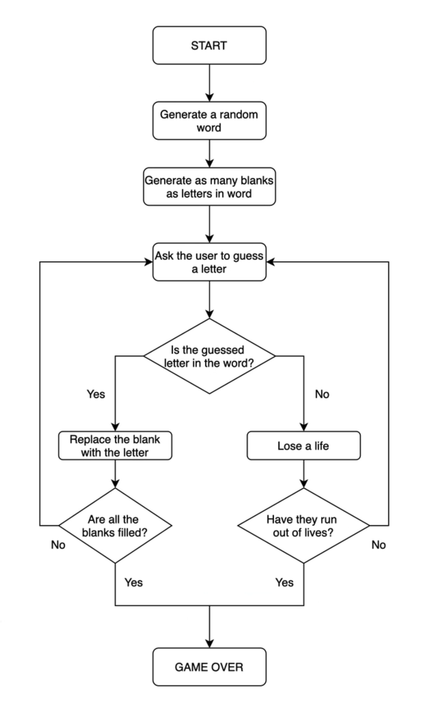
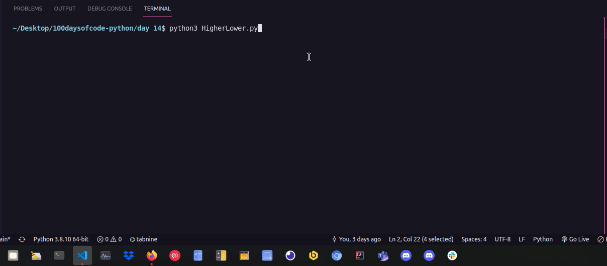

# 100daysofcode-python

## Day 01 - Band Name Generator ✅

## Day 02 - Tip Calculator ✅

## Day 03 - Treasure Island ✅

### The Flow

### The Solution

## Day 04 - Jokenpo ✅

## Day 05 - Password Generator ✅

## Day 06 - Escaping the Maze ✅

## Day 07 - Hangman ✅

### The Flow

### The Game

## Day 08 - Caesar Cipher ✅

## Day 09 - Secret Auction ✅

### The Flow

### The Solution

## Day 10 - Calculator ✅

## Day 11 - Black Jack ✅

## Day 12 - Number Guess ✅

## Day 13 - Praticing Debbugging ✅

## Day 14 - Higher or Lower ✅

## Day 15 - Coffe Machine ✅

## Day 16 - Coffe Machine - in OOP ✅

## Day 17 - Trivia game ✅
